**Purpose:** To introduce the principles and techniques of thematic mapping, including dot density, proportional symbol, and choropleth mapping, as well as data classification and basic map design. As a demonstration, you will acquire and map spatial data on the total population by state of the contiguous U.S. using data from the 2010 U.S. Census.

# Acquire State Population Data from the U.S. Census Bureau

In a web browser, navigate to [https://www.census.gov/geo/maps-data/data/tiger-data.html](https://www.census.gov/geo/maps-data/data/tiger-data.html).

Under '2010 Census' open Demographics Profile 1 - Shapefile Format.

Scroll down and click on the 'States' link to download the 'State_2010Census_DP1.zip' file.

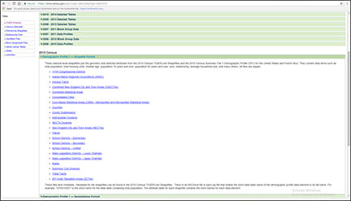\ 

Copy the downloaded zip file into your workspace and unzip it.

View the spatial and attribute data for the State_2010Census_DP1 shapefile in ArcCatalog.

# Convert the Shapefile to NAD 1983 Contiguous USA Albers

In ArcCatalog, use the Project tool in ArcToolbox to create a new shapefile that is in the 'NAD 1983 Contiguous USA Albers' projection and coordinate system.

Call the new shapefile 'State_2010Census_DP1_Albers' and be sure to send it to your workspace.

# Select and Export the Contiguous United States

Open ArcMap and add the State_2010Census_DP1_Albers shapefile.

In ArcMap, select all the states except for Alaska, Hawaii and Puerto Rico.  Also select the Washington, D.C. (you can do this by using the spatial select  button on the toolbar to draw a rectangle around the contiguous U.S., or you can do this by opening the attribute table).

Export the selected states to a new shapefile by right clicking on the name of the shapefile in the Table of Contents (the window on the left side of ArcMap adjacent to the map itself), going to Data, and then Export Data to open the Export Data dialog box.

Leave the default settings in the dialog box.

Call the new shapefile 'Contiguous_States' and be sure to send it to your workspace. 

Add Contiguous_States to ArcMap and remove the State_2010Census_DP1_Albers shapefile. 

# Explore the Attribute Table

In ArcMap, open the Contiguous_States attribute table and review the field names.

The `GEOID` field is a unique numeric code for each state used by the U.S. Census Bureau.
The `STUSPS10` field is the two letter U.S. Postal Service code for the state.
The `NAME10` field is obviously the name of the state.
The `ALAND10` field is the land area of the state in square meters.

Note that most field names use a code composed of a set of letters and numbers, e.g. `DP0010001`.

In Microsoft Excel (not ArcGIS), open the Excel file 'DP_Table Descriptions.xls'.

Here you will see the definition of each of the field names in the Contiguous_States attribute table.

The fields contain data on the population of each state, including the total population, and population counts broken down by age, sex, race, Hispanic ethnicity, and household characteristics (e.g. types of families, renters versus home-owners, etc.)

Note two other important fields we will use in the lab assignment:

The `DP0010001` field is the total population of each state.
The `DP0100002` field is the Hispanic population of each state.

Return to the Contiguous_States attribute table in ArcMap.

It is often useful to sort the table based on a field's values, say, from highest to lowest.

As an example, you will sort the table based on the total population, where states with the highest population will be at the top and those with the lowest at the bottom.

To do this, right click on the total population field (DP001001) and choose 'Sort Descending'.

Note the table is now in the order of states from the highest population (California - 19,378,201 people) to the lowest (Wyoming - 563,626 people).

# Make an Area-Class Map of the States

In ArcMap, in the Table of Contents double-click the Contiguous_States shapefile to open the Layer Properties box.

Click on the Symboloby tab if it is not already active.

Here, we will assign a unique color to each state.

Under 'Show:' choose 'Categories' and 'Unique values'.

Under 'Value Field' choose `STUSPS10`.

Click the 'Add All Values' button.

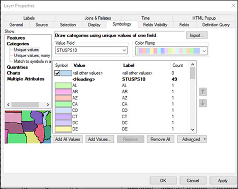\ 

Click on the 'OK' button.

You should see a map that looks something like this:

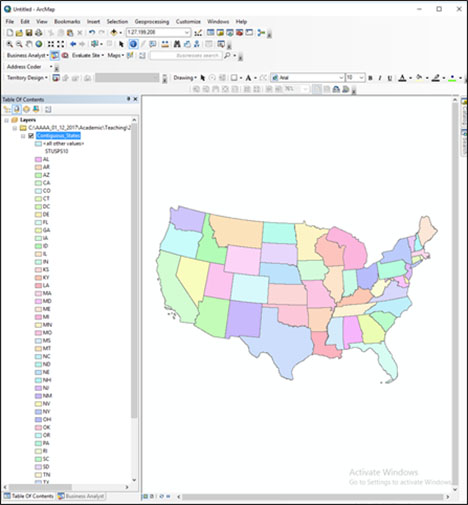\ 

# Add State Name Labels

Now, we will set our preferences to label each state with its appropriate two letter code.

Open the Layer Properties box.

Click on the 'Labels' tab.

Under 'Text String,' 'Label Field' choose `STUSPS10`.

Click on the 'OK' button.

Now, we will display the state code labels.

Right-click on the Contiguous_States shapefile in the Table of Contents and go to 'Label Features'.

Labels of the state code (e.g. PA for Pennsylvania) should appear on each state.

# Make a Proportional Symbol Map of Total Population

Turn off the Label Features option so the labels do not appear.

Open the Layer Properties box.

Go to the Symbology tab.

Under 'Show:' choose 'Quantitites' and 'Proportional Symbols'.

Under 'Fields' and 'Value:' choose the field that contains the total population - `DP0010001`.

Click on the 'Apply' button (this enables the map but keeps the Layer Properties box open).

You should see a map that looks something like this:

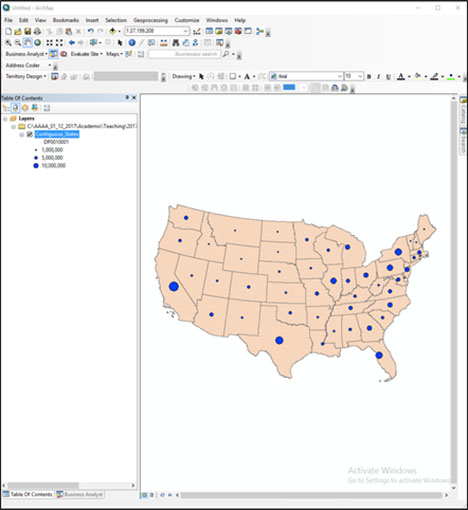\ 

In the Layer Properties box, you can change the background color, and the size, color, and symbolization of the dots under the 'Symbol' options by double-clicking on the 'Background' and 'Min Value' items.  

Experiment with different background colors and dot colors and symbolization to change the look of the map.

# Make a Dot Density Map of Total Population

Open the Layer Properties box.

Go to the Symbology tab.

Under 'Show:' choose 'Quantitites' and 'Dot Density'.

Under 'Field Selection' choose the field that contains the total population and then click on the '>' button so that the field appears in the text box on the right:

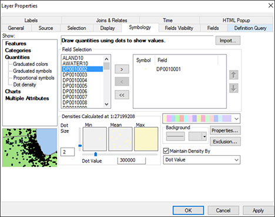\ 

Click on the 'Apply' button (this enables the map but keeps the Layer Properties box open).

You should see a map that looks something like this:

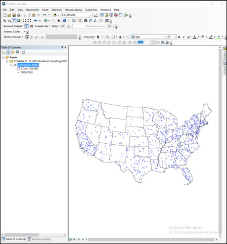\ 

Note the dots may be faint depending on the color scheme you've chosen (or defaulted).

In the Layer Properties box, you can change the background color, dot size, value, and color.  

Experiment with different background, size, value, and color symbolizations to change the look of the map.

# Make a Choropleth Map of Population Density

Open the Layer Properties box.

Go to the Symbology tab.

Under 'Show:' choose 'Quantitites' and 'Graduated Colors'.

Under 'Fields' and 'Value:' choose the the field that contains the total population.

Here, we will map the population density - the total population divided by the land area of each state.  The population density yields a measure of people per unit area (e.g. people per square mile).  Thus, population density shows the concentration of population, accounting for the fact that given two states with the same total population, if one is much larger in area than the other, the population will be more sparsely distributed.

For this, under 'Normalization' choose the field that contains the land area of each state - `ALAND10`.  This will thus map the value of states total population divided by its land area (in square meters).

Under 'Classification' click on the 'Classify' button to bring up the Classification dialog box.

Under 'Classification' and 'Method' choose 'Quantile'  

A quantile classification keeps approximately the same number of records (states) in each class while the range of each class is allowed to vary.

The dialog box shows you a histogram of population density values.  Note there is one outlier feature on the far right with a very high population density (which state or territory do you think it is...?).

Break values for the different classes are reported as blue lines in the histogram and in text on the right side of the dialog box. These are generated automatically by the classification method (here, quantile).

You can also change these manually by dragging the blue lines or entering numbers as text in the Break Values (though this would change the classification to something other than quantile).

Press the 'OK' button.

You can also choose a different color scheme under 'Color Ramp'.  Choose a blue sequential color scheme.

Press the 'OK' button.

You should see a map that looks something like this:

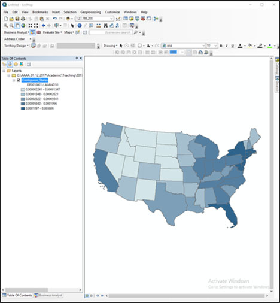\ 

Using the Classification dialog box, experiment with the equal interval and natural breaks data classifications.  

Experiment with creating your own data classification by manually changing the class break values by grabbing and moving the blue lines shown on the histogram in the Classifcation dialog box.

For each data classification you choose, note the differences in the class breaks as expressed on the histogram in the Classification dialog box and consequently the changes in the map.  

You can also experiment with different Color Ramp options.  Note, however, that only sequential or divergining color schemes are appropriate for continuous data such as population density.

# Design a Map Layout

Once you have created a particular map of population density with an appropriate data classification and color scheme, you can design a map layout and add other essential elements such as a legend, scale bar, etc. Switch to Layout View.

First, you will insert a legend.  Go to the 'Insert' menu item at the top toolbar and choose 'Legend' to open the Legend Wizard.

Simply click the 'Next' button for each of the wizards windows until a legend appears.

Note that the legend is a graphic object that can be grabbed and moved, changed in size, etc., as is the map in the Layout View. 

It is also related to the legend in the Table of Contents.  If you change the symbolization in the Data View, the legend will automatically adapt.

For instance, let's change the number of displayed signficant digits in the population density to make them easier to read.

Open the Layer Properties box.  Right click on the labels and go to 'Format Labels'.

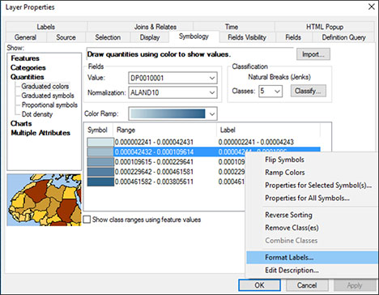\ 

Under 'Rounding' chose 'Number of decimal places' and below enter the number 5. Click the 'OK' button.

Notice the change in the both the Table of Contents and the legend.

In order to format the legend properly, it is often easier to break it into smaller graphic pieces, which also breaks the relation to the legend in the Table of Contents.

Select the legend, right click on it, and choose 'Convert to Graphics'.  

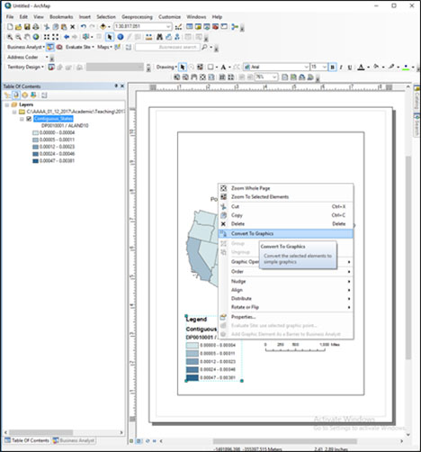\ 

Then, right click on the legend again and choose 'Ungroup'.  This will break the graphic into its graphic and text components.  

Double clicking on a text object allows you to edit the text.  Double clicking on a graphic object allows you to edit the color and size of the object.  

Certain objects may be further ungrouped. You can select multiple objects and regroup them by right clicking and choosing 'Group'.

Alter the legend so it appears something like this:
 
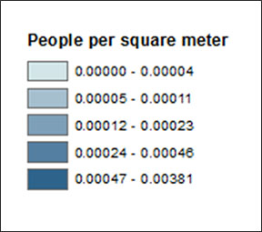\ 

Insert a scale bar by going to the 'Insert' menu item and choosing 'Scale Bar'. 

Choose the top scale bar option, or you can choose another one if you like.

Like the legend, the scale bar is related to the Data View window - if you change the scale of your map (i.e. zoom in or out), the scale bar will also change automatically.  

Grab and change the size of the scale bar so that it has a round number (e.g. 1000 miles across).

Insert a north arrow by going to the 'Insert' menu itme and choosing 'North Arrow'.

Choose whichever North Arrow you like and adjust its size.

You can also insert a title by going to the 'Insert' menue itme and choosing 'Title'.  Double clicking the title object will allow you to change the font, size, and other text characteristics.

Drawing tools to insert shapes and other graphic objects, and text tools to insert and edit text are also available in the drawing toolbar.  These behave similarly to graphics handling in many other software packages, such as MS Word.   

Arrange the legend, scale bar, and north arrow aesthetically and efficiently on the map. A simple and reasonable layout could look something like this:

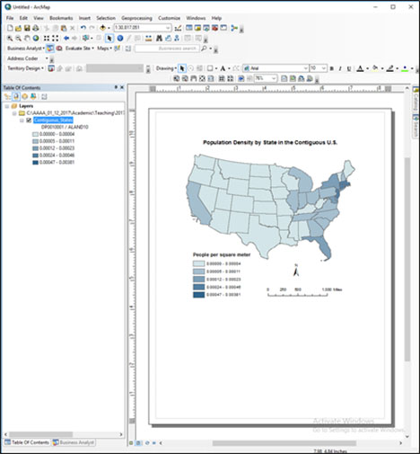\ 

You can export your map as an image file so that it can be inserted in other documents, such as a MS Word document or MS Powerpoint presentation or posted to a website.  

To export your map go to the 'File' menu item and choose 'Export Map'.  

In the Export Map dialog box you can give the image file a path and file name and choose a format.  A common image format is .jpg, though .eps, .png, and other formats are available.  A .jpg resolution of 300 dpi is advisable for use in your lab reports for this course.

# Assignment

## Objective

For this assignment you are to to describe the spatial distribution of the Hispanic population in the U.S. by state, according to the 2010 U.S. Census.
   
## Deliverables

Turn in a report in the format described in the syllabus.  

Be sure to include the following information:

1. The five states that have the highest number of Hispanics, and the Hispanic population of each.
2. The five states that have the lowest number of Hispanics, and the Hispanic population of each.
3. The states that have a Hispanic population greater than the total population of the smallest (by population) state in the U.S.
4. A proportional symbol map or a dot density map that shows the distribution of the number of Hispanics in each state.
5. A choropleth map, using a sensible data classification of your choice, that shows the percentage of Hispanics in each state.

## Getting Started

All the data and operations you need to complete this assignment are described above.  

Be sure to identify the field in the attribute table that contains the Hispanic population (it is noted above in this lab document).

You can use the Sort Descending option in the attribute table to identify the states with the highest and lowest Hispanic population. 

To create a choropleth map of the percent Hispanic population for each state, you can use the Normalization option in the Layer Properties box to map the Hispanic Population / Total Population (which yields the percent of the total population that is Hispanic in each state).

In your report, be sure to include the following information (see the syllabus for lab report guidelines and formatting):

* **Introduction:** State the research question (i.e. to describe the spatial distribution of the Hispanic population in the U.S. by state).
* **Data and Methods:** State the U.S. Census data used, from where it was acquired, the GIS operations employed to do the analysis, and the mapping techniques employed (i.e. state and justify why you chose specific mapping options, such as the type of map, color scheme, the particular data classification for your choropleth map, and so on).
* **Results:** Report on the expected deliverables noted above.
* **Discussion:** Interpret your results by briefly describing the overall spatial pattern of where Hispanics are concentrated in the U.S. (as of the 2010 U.S. Census) and why Hispanics may be concentrated in those particular states. State the limitations of the analysis (e.g. looking at the state level may not reveal within-state variation in Hispanic population), and how this analysis might be improved (e.g. by examining county level data).
* **Tables and Figures:**  Insert all tables and figures (including maps) at the end of the report, each on a separate page, with a label (e.g. Figure 1).  Be sure to cite each table and figure included in the body of the report text.

