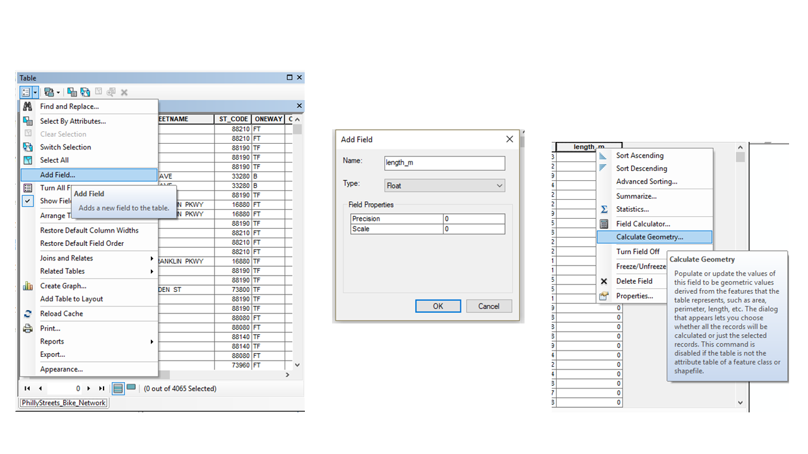
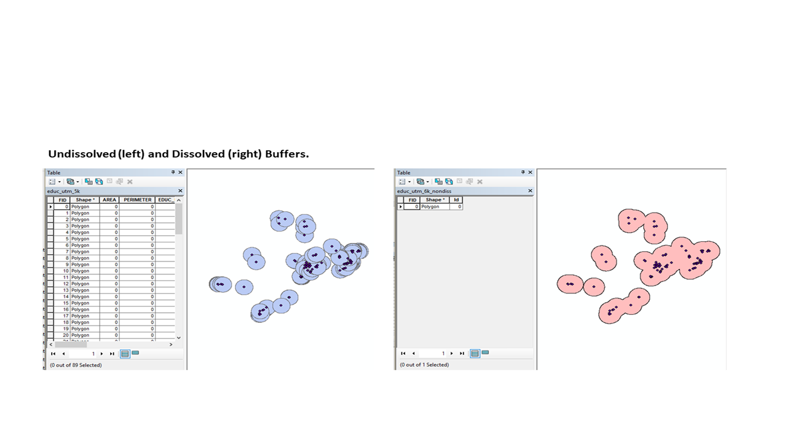
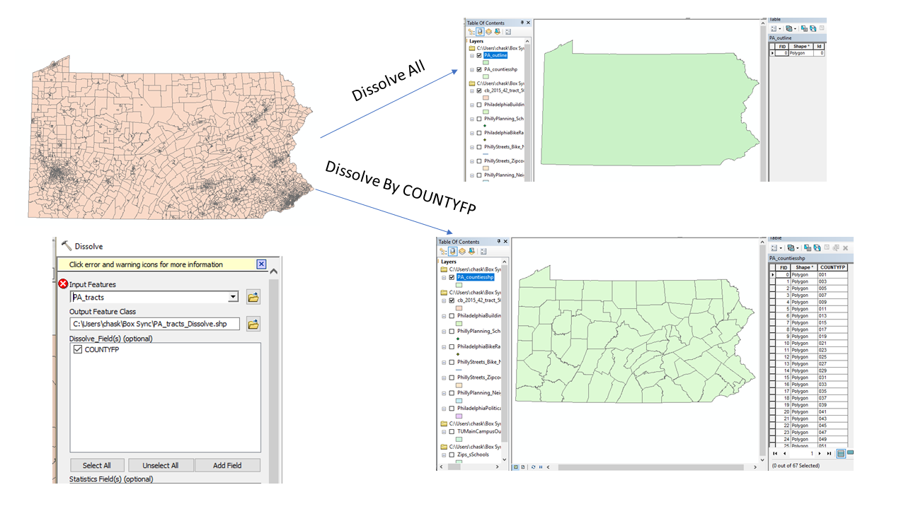
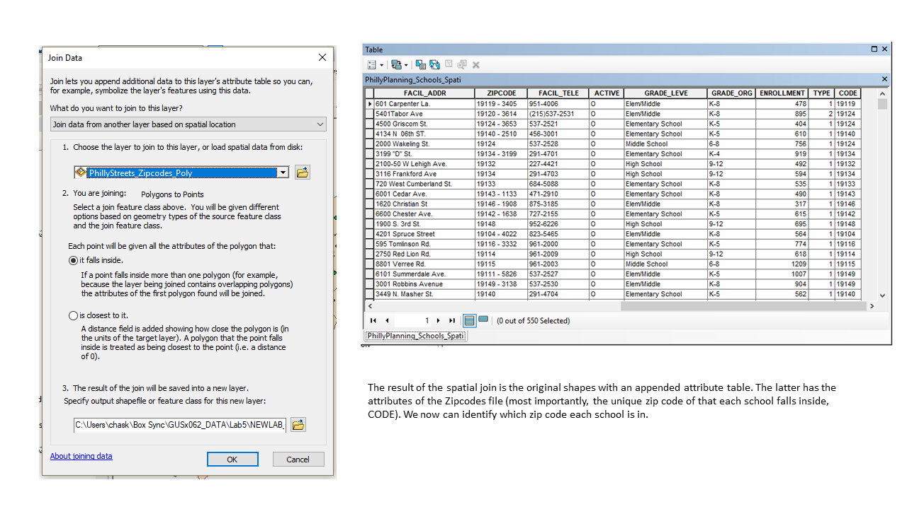
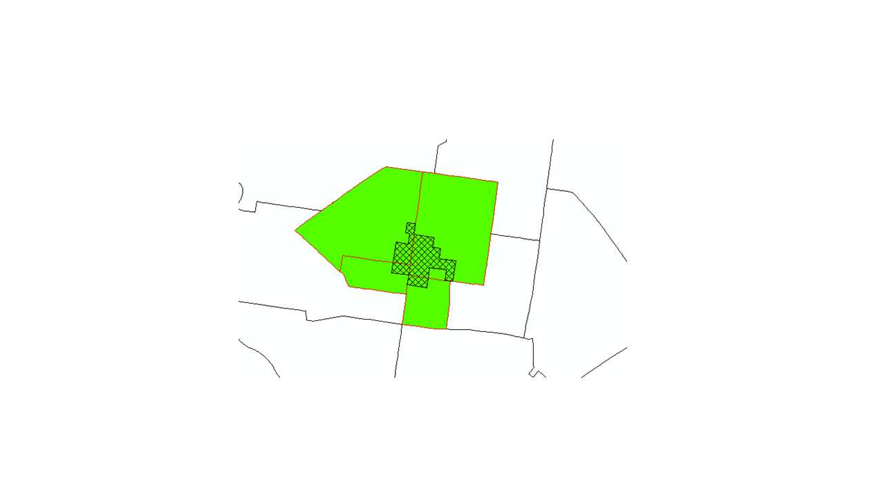
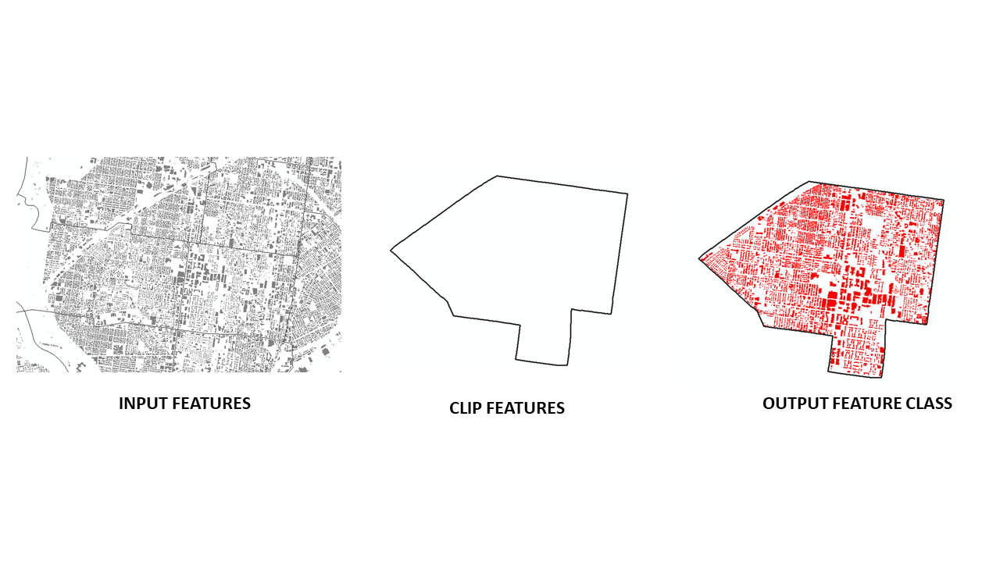
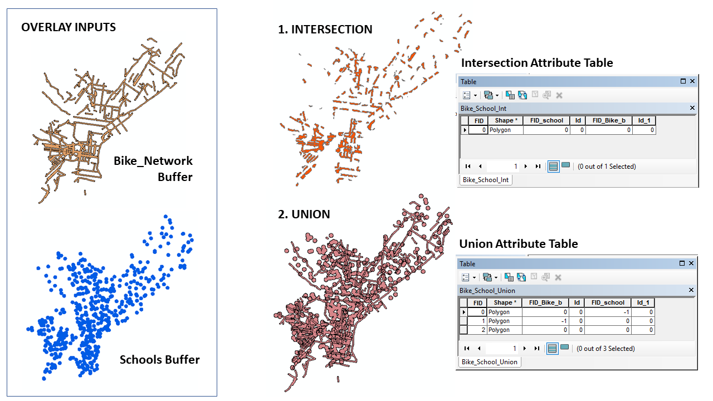

**Purpose:** To introduce vector operations, including buffer, map dissolve, and overlay operations. 

# Data

Note: The tutorial portion of this lab uses a variety of data layers to demonstrate how various vector operations work. After each section, remove all layers or close ArcMap. Also, the assignment portion of the lab uses a different set of layers. 

We will work with data made publically available by the Pennsylvania Geospatial Clearinghouse ([PASDA](http://www.pasda.psu.edu)). For more details on how to download and prepare data, refer to Lab 2. 

1. From PASDA, use the search function to find and download the following files layers:

- Bike Racks Year 2012
- Philadelphia Buildings Year 2017
- Philadelphia Planning Neighborhoods Year 2016
- Philadelphia Planning Schools Year 2016
- Philadelphia Streets Bike Network Year 2016
- Philadelphia Streets Zipcodes Poly Year 2016
- Pennsylvania Census Tract Shapefile Year 2010.

Some of these files will be used for the tutorial portion of the lab. Others will be used for the assignment. They will be referred to throughout this lab exercise by a short but clear name, such as "Bike Network" rather than "Philadelphia Bike Network".

Next, set up your Environment in ArcMap. This will specify a location for all of your outputs when running different operations and make it esier to save generated files.

1. Open ArcMap, select the Geoprocessing file menu, and choose Environments. 
2. Set the Current and Scratch Workspaces to your the folder on your flash drive or local hard drive where you are saving your files. (See example below; your path will differ.) You do not need to modify any of the other fields. Click OK. Each time you run an operation, the output will be saved to your workspace. Be sure to set up your Environment in ArcMap and/or ArcCatalog each time you begin working. 
    
    \ 
    
3.  Open ArcCatalog and examine the properties of the shapefiles you just downloaded, paying attention to the XY Coordinate System tab. Because most of these data come from the City of Philadelphia by way of PASDA, they will most like likely be in State Plane coordinates (NAD\_1983\_StatePlane\_Pennsylvania\_South\_FIPS\_3702\_Feet). 
4.  In ArcMap and add the Bike Network shapefile. Remember, the data frame in ArcGIS will adopt the coordinate system of the first layer added. Open the attribute table and find the field SHAPE\_Leng, which provides a measurement of the length of each individual line segment measured in US feet (the native linear unit of the State Plane coordinate system).

# Tutorial 

Note: **Vector operations** refers to a variety of tools that operate on vector data. While far from exhaustive, this lab tutorial walks through a set of extremely commonly used operations. Each section of the tutorial is essentially a standalone mini-tutorial that introduces how a specific operation works. You will notice that each of these operations has a variety of settings and capabilities beyond what you are instructed to do. You are encouraged to explore the various functionalities of these tools. In the assignment, you will be asked to work with several of these tools in sequence, performing a classic **suitability analysis**, through which these tools identify optimal locations based on a set of criteria.

# Retrieve Line Length and Polygon Area Measurements 

Here, you will learn how to use ArcMap to calculate line length and polygon area and encode these values in an attribute table. 

Here, we will add a new field and populate the field with new length values in meters. 

1.  Add a new field to the Bike Network shapefile and call it `Length_m`. Make it a float type, and press OK.
2.  Right click on the header for the new field (where it says `Length_m`) of the field at the top of the column and go to Calculate Geometry.
    
     
    
3.  Click Yes to confirm you want to edit this field. In the Calculate Geometry dialog box make sure Property is set to `Length` and the Units is set to `Meters [m]`. Click OK. You should see the new length values appear in the field.
4.  Add the Zipcodes Poly shapefile to ArcMap and open its attribute table. Find the `SHAPE_Area` field. This field contains the area of each zip code in square feet.
5.  Create a new field called `Area_m`. Follow the analogous procedures as for the Bike Network, but instead of length choose to calculate the area in square meters.
6.  Remove all data layers from ArcMap.

#Buffer 

Here, you will learn how to use ArcMap to perform a buffer operation on points and lines. 

1. Add the Schools shapefile to ArcMap. 
2. The Buffer tool can be accessed two ways. For quick access, from the Geoprocessing menu, select Buffer. 
The Buffer tool can also be accessed from the ArcToolbox. Open ArcToolbox in ArcMap, and go to Analysis Tools→Proximity→Buffer. 
3. Drag Schools.shp into the input features box. Call the output shapefile `schools_buf300m` and make sure it saves to your workspace (which might or might not be the default location). For the Distance box, under Linear Unit, enter 300 meters. For Dissolve Type choose ALL. Leave the rest of the options as the defaults. Press OK. 
4. View the new `schools_buf300m` shapefile in ArcMap. Zoom in to where there are clusters of schools to see how the buffers merge together (i.e. are dissolved as single polygons in these locations). 
5. Repeat the buffer operation with this shapefile (Schools), experimenting with different settings in the Buffer tool. For example, change the distance in the Linear Unit option to a larger value and try the NONE dissolve option. Note that the operation can take a lot of time given certain settings. These types of operations can require significant processing power. 
    
    \ 
    
6. Once you have created a buffer with the NONE dissolve option compare the results to the original (dissolve ALL) buffer. The key to understanding the difference is in comparing both the visible features but, just as importantly, the difference in the attribute tables. Note: in the image that in the undissolved buffer there is a one-to-one correspondence between each original object and the buffers the operation creates. The attribute table looks precisely like the attribute table from the Schools file. In the dissolved buffer, however, the result combines all of the buffers into a single object. You can think of this as a binary: the areas within 300 m of an educational institution (inside the shapefile) as opposed to those that are not. We will used dissolved buffers later on this lab because they are useful analytically (as you'll see).
7. Open the attribute table for `schools_buf300m`, noting again that although there are multiple polygons displayed on screen, there is only a single record in the attribute table (this is called a "multipart object"). 
8. In some cases, it is useful to have an individual record for each feature. To make this conversion, where each polygon is represented as a single record in the attribute table, go to ArcToolbox?Data Management Tools→Features→Multipart to Singlepart and input schools_buf300m and name the output schools_buf300m_single. Open the output table from the resulting shapefile and confirm that it has multiple records—one for each feature. 
9. When you are finished, close ArcMap and do not save. 

# Map Dissolve 

Here, you will learn how to use ArcMap to generalize a data layer by dissolving all of the features and dissolving into adjacent polygons with identical values.

1. Open ArcMap and add the `PA Tracts` shapefile. Go to the Geoprocessing file menu and select Dissolve. Note that the Dissolve tool can also be accessed from ArcToolbox (ArcToolbox→Data Management Tools→Generalization→Dissolve).
2. Drag the PA Tracts shapefile into the input box. Name the resulting file `PA_outline`. Leave all the other commands alone and press OK. Take a close look at the attribute file and the result. The operation has dissolved all the boundaries between the tracts, resulting in an outline of the entire set of features (i.e., the entire state of Pennsylvania). You'll notice that the resulting feature has one entry in the attribute table.

     

3. Now compare what you have just done to what happens when you dissolve by an attribute. Open the attribute table of PA Tracts and find the field `COUNTYFP10`. This field is a 3-digit identifier for each individual county (e.g. `091` for Montgomery County) in the state. You'll notice that the GEOID code full name for all the tracts in Philadelphia begins `42101` (`42` for Pennsylvania; `101` for Philadelphia County). Of course, many individual tracts share the same value for this field. It is thus possible to perform a map dissolve operation on the PA tracts shapefile, using the `COUNTYFP10` field as the dissolve field.
4. Open the Dissolve dialog box again.  Drag the PA tracts shapefile into the input box. Name the output shapefile PA\_Counties. Under the Dissolve Field option click COUNTYFP10. Press OK.
5. View the resulting shapefile in ArcMap. You'll see that the tracts have been dissolved by the county identifier, resulting in a shapefile of county outlines.
6. Close ArcMap.

# Point in Polygon Overlay 

Here, you will learn how to use ArcMap to perform a point in polygon overlay, also called a **spatial join**. When you need to know which polygon a point is within, you can do so by joining the attributes of a polygons layer to a set of points. Here, we will determine which zip code each of the point locations from the Schools shapefile lies within.

1. Open ArcMap and add the Schools shapefile point shapefile and the polygon Zipcodes shapefile. Review each of their attribute tables and note the fields that are included in each.
2. Right click the Schools shapefile and choose Joins and Relates→Join. 
3. In the new window, the top drop down menu should read `Join data from another based on spatial location`.
    
    > Note: As is so often the case, there's an additional way to implement spatial join functions in ArcGIS generally, the "Spatial Join" tool. In Toolbox, click on Analysis Tools→Overlay→Spatial Join. You will see that compared to the route we are taking (Joins and Relates→Join), the more comprehensive Spatial Join tool offers quite a few additional options. It is worth exploring more fully if you are interested in getting a deeper understanding of point- and line-in-polygon operations. 
    
    \ 
    
4. Choose Zipcodes as the layer to join to the Schools layer. You are given a choice of how to associate each polygon with a given point. Here, choose "it falls inside". 
5. Name your new shapefile (`Schools_wZip` will suffice). 
6. Press OK
7. View the new shapefile's attribute table. You will observe that the attributes from the Zipcodes file are now appended to the attributes of the original Schools shapefile, based on the ZIP code each school falls within.. 

You can also join points to polygons. The problem, however, is that many points can fall within a single polygon. Since we cannot store multiple values of a single attribute for a single polygon (a violation of first normal form), the software provides a few options for transforming potentially multiple point values to a single value for each polygon.

1. Right click on the Zipcodes shapefile and choose Joins and Relates→Join. In the new window, the top drop down menu should read "Join data from another based on spatial location". 
2. Choose the Schools shapefile as the layer to join to the Zipcodes layer
3. Note that it now reads "You are joining: points to polygons". You are given a choice for how to summarize the point data. Option one counts the number of points within each polygon and then offers some statistical functions based on combining the attributes of multiple points that fall within each polygon. Option two simply takes the point nearest the polygon, or if many points fall within a single polygon, it takes the first point that the algorithm comes to. 
4. Here, choose the first option (you don't have to choose any statistical summary option). 
5. Choose a name for your new shapefile. 
6. View the new shapefile and open its attribute table. You should see a new field called Count that contains the number of Schools points that fall within each polygon. 
7. Remove all the layers from ArcMap. 

# Line in Polygon Overlay 

Here, you will learn how to use ArcMap to perform a line in polygon overlay. 
You can also do a line in polygon overlay in a manner analogous to the point in polygon overlay demonstrated above. Here, however, multiple lines can fall within a single polygon, and multiple polygons can fall across a single line. Thus, the user must supply the method of summarizing multiple values for both spatial joins from polygon onto line layers and from line onto polygon layers. 

1. Use the Bike_Network and Zipcodes shapefiles in ArcMap to experiment with different line in polygon overlay parameterizations. Try the spatial join in each direction as you did with Schools and Zipcodes above. 
2. Observe the shapes themselves as well as the attribute tables and note how new attributes have been appended as a result of the operations.
3. Remove all the layers from ArcMap. 

# Polygon Overlay: Clip 

Here, you will learn how to use ArcMap to perform a clip operation.

A Clip operation is akin to a "cookie cutter" operation whereby one layer is clipped to the boundaries of another. For instance, say you were interested in which buildings fall within the City of Philadelphia's recognized neighborhoods, it is possible to extract the buildings that fall within these neighborhoods as a separate shapefile.

1. Begin by adding the Neighbhorhoods and Buildings shapefiles to ArcMap.
    
    \ 
    
2. Create a new shapefile that represents only the neighborhoods around Temple's Main Campus Montgomery County. You can do this by using a Select by Attributes operation, selcting the following neighborhoods: NORTH CENTRAL, CECIL B. MOORE, YORKTOWN, and NORTH PHILA. Export the selected features to a new shapefile called TU_area. Make sure the file exports to your workspace (again, this location might not be the default) and is specified to export as a shapefile. 
3. Now dissolve the resulting shapefile to make it a single object, the outline of the combined neighbhorhoods. Call it TU_Area_diss
4. Go to the Geoprocessing file menu and select Clip. Note that the clip tool can also be accessed from ArcToolbox (ArcToolbox→Analysis Tools→Extract→Clip). 
    
    \ 
    
5. Drag Buildings into the input features box. Drag TU\_area\_diss into the clip features box. Name the output shapefile Bldgs\_TU.  This may take a minute or two as the buildings layer is geometrically complex.
6. View the new shapefile, zooming in to see more detail. It should include only those building footprints that are within the bounds of the TU\_area shapefile.
7. Remove all the layers from ArcMap. 

# Polygon Overlay: Intersection and Union 

Here, you will learn how to use ArcMap to perform a two polygon overlay operation--Intersection and Union. 
The intersection overlay operation creates a new data layer from the areas that overlap when you overlay multiple polygons shape files (that is, the areas that are spatially coincident). Say you were interested in finding areas that were both close to schools and bike networks. An intersection operation would show you what these are.

1. Open ArcMap and add the Bike_Network shapefile and the schools_buf300m (that you created earlier). 
2. Create a 100 meter dissolved buffer (Dissolve Type: ALL) around the Bike_Network shapefile, naming the new file `Bike_Net_buf100m`.
3. Go to the Geoprocessing file menu and select Intersect. Note that this tool can also be accessed from ArcToolbox (ArcToolbox→Analysis Tools→Overlay→Intersect). 
4. Drag `schools_buf300m` and `Bike_Net_buf100m` into the input features box. Call the output `bike_edu_bufint`
5.  View the resulting shapefile, zooming in to see more detail. It should include the area spatially coincident to both layers. Now view the attribute table. It should also contain attributes of both input shapefiles. Note that the `Area_M` file is no longer up to date and would need to be recalculated (if used for subsequent analysis).

 

Now we'll perform a similar overlay, this time using the Union tool.

1. From the Geoprocessing menu, choose Union and enter the `schools_buf300m` and `Bike_Net_buf100m` shapefiles.  Name the output `bike_edu_bufun.shp`.
2. View the result. The resulting shapefile should contain those areas that are within 300m of a school or are in within 100m of the bike network (i.e. all the area covered by both polygon data layers).
3. Please note that if you did not choose to dissolve the buffers when they were generated previously (an option in the buffer dialogue) your union table will be hard to decipher. If you get a long attribute table in your union go back and try your buffers again.
4. The key to understanding the output of the union is the attribute table. In the attribute table of the resulting layer from the union operation, find the field(s) that begins `FID_`. Note that there are different values for this field, including -1. The values that are greater than -1 indicate that this polygon is inside the buffer, while a value of -1 indicates the polygon is outside the buffer. Thus the polygons inside the original school buffer have value of > -1 for the FID\_school field.  This is how ArcGIS keeps track of what is inside or outside of a buffer. To demonstrate this, perform a selection selecting those polygons that are greater than 1 for this field. You should see polygons within the schools shapefile buffer selected. Switch selection to see the polygons outside the educational shapefile buffer selected.

## Multipart to Singlepart

As you inspect the results of the union operation from above, you'll notice that there are many more individual features in the resulting shapefile. But the attribute table has far fewer records in it. This is called a "multipart object," where a single record in the attribute talble can represent multiple spatial objects.

Occasionally it is useful analytically to break those multipart objects into objects where each object is represented by a single record in the attribute table, for instance, if you needed to calculate the area of each of the features in teh attribute table, they would need to be encoded as a single part object. The multipart to singlepart tool creates a new feature for each non-contiguous feature. So each individual polygon you see in the union file would become a new object in the resulting file, with a unique record in the resulting attribute table (allowing you to add a field and calculate the area of each). The geometry of the file will not change - only the attribute table. We will perform a multipart to singlepart operation here.

1. Select the part of the union table that is within the school buffer, but outside of the bike network buffer, i.e. 0 for the school buffer column and -1 for the bike network buffer. (You just created this union file with the bike network buffer and the school buffer) 
2. Export the selected features by going to Data->Export to create a new shapefile out of the selected features. You can name it School\_not\_Network.
3. Inspect the new shapefile and see that it only has one record in the attribute table. 
3. Press `Ctl`+`F` to bring up the operation search dialog box. Type in 'multipart' and press Enter.  Choose the tool multipart to singlepart. 
4. Drag in School\_not\_Network as the input. Name the new file mpart\_school\_not\_Network. Press ok. 
5. Inspect the resulting file. The map features of mpart\_school\_not\_Network look exactly like School\_not\_Network. Inspect the attribute table, however, and you'll see that the new shapefile has a different record for each discrete feature.

# ASSIGNMENT 

## Objectives 

Biking has become an increasingly popular mode of transportation in Philadelphia, and bike advocacy organizations have started to lobby for the City to install additional bike racks. A number of bike racks have been installed along the sidewalks with heavy bike traffic. Although the number of bike racks around the Temple area has increased substantially over the past few years, so has the number of people looking to lock their bikes near campus, forcing a lot of people to improvise. 

The objective of this assignment is to identify areas for potential bike racks in the neighborhoods surround Temple University's Main Campus. These bike racks should be: 

1. Within 75 feet of the Philadelphia bike network 
2. Within 20 feet of a building 
3. Not within 500 feet of an existing bike rack.
4. An area between 300 and 1000 square feet.

Use the following layers for this analysis:

* Bike Racks
* Bike Network
* Buildings
* Neighborhoods - use the shapefile called `TU_Area_diss` that you created in the tutorial using the Clip function

Note: the City of Philadelphia's bike racks are separate from Temple University's. Assume for the purpose of the lab that the city is using this analysis as a first cut to determine suitable areas. A second step, not part of this lab, would then be to determine which of these areas are already served by Temple University bike racks.

# Deliverables 

Turn in a report addressing this objective. This report should include a map of the potential area(s) in which to add a bike rack. All shapefiles should be in StatePlane Pennsylvania South. Your lab should also include a flowchart/cartographic model to illustrate your methodology. 

# Getting Started 

When you perform spatial operations, the measurements are calculated in terms of the measurement units of the assigned coordinate reference system. Therefore, before you begin working, make sure all layers are in State Plane Pennsylvania South coordinates. 

1. In order to make the processing more efficient, clip the Buildings, Bike Racks, and Bike Networks shapefiles to the Temple University neighborhood using the TU_area shapefile created above.
2. Use the Buffer tool (Analysis Tools→Proximity→Buffer) to buffer the Bike Racks, Bike Networks, and Buildings shapefiles, using the distance criteria given above.
3. When buffering, make sure to choose Dissolve Type = `ALL`. Additionally, when you are buffering the buildings, please choose the Side Type to be `OUTSIDE_ONLY` so that your buffer does not include the building footprint.
4. Once you have your buffer layers, once again clip the buffered features to the neighborhoods adjacent to Temple using the TU_area shapefile (to eliminate the buffered areas that extend outside the Temple University neighborhood).
5. Clip the buildings buffer to the bike networks buffer. We are doing this because we do not have the processing power required to run a union with the Philadelphia buildings file and the other buffers.
6. Using a combination of the intersect and union tools identify areas that are within 100 feet of a bike network and 30 feet of a building but NOT within 200 feet of an existing bike rack.
7. Once you have selected the suitable bike rack areas, you may need to use the Multipart to Single Part tool to create a new record for each polygon. You will then need to calculate the area for each of the polygons, and select the polygons that meet your area criteria.
NOTE: All of the tools that you need to complete the lab are described in the lab tutorial. If you are unsure of where to find a tool or how to use it, please refer back to the description in the tutorial or ask the instructor. 

Write a lab report that includes: 

* **Introduction:** State the goal of the analysis
* **Data and Methods:** State the data layers and the analytical steps taken. Refer to the flowchart.
* **Results:** Report on the location of the proposed bike racks. Refer to the map.
* **Discussion:** Interpret your results. Consider the limiation of this analysis, and discuss what variable you could add to make the analysis better.
* **Tables and Figures:** Include one map that correctly displays the requested information and one flowchart that documents the analytical stips taken. Insert both at the end of the report, each on a separate page, with a label (e.g. Figure 1). Be sure to cite each figure in the body of the report text.

