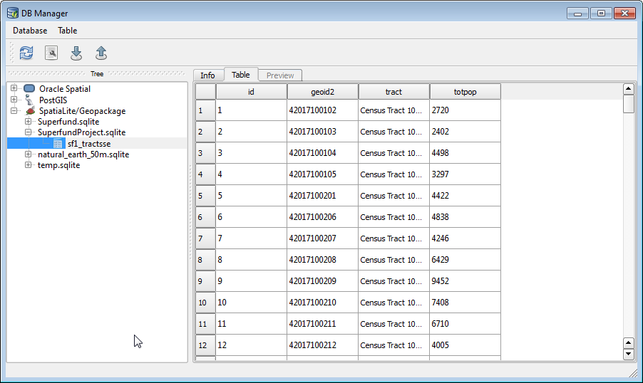
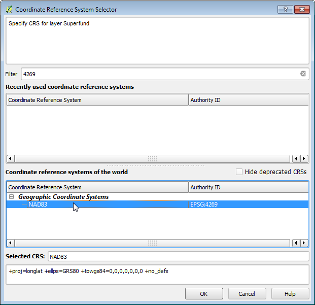

SQL Database Query in QGIS
==========================

Version 1.0
-----------

Purpose of the lab:

-   Introduce basic SQL syntax
-   Introduce joins and spatial joins in SpatiaLite
-   Become familiar with QGIS DB Manager

Tutorial
========

Background on Data Formats
--------------------------

The shapefile format is widely supported, but this is about the only thing it has going for it. Shapefiles have, in my opinion, three strikes against them:

1.  It is a multi-file format, and worse contains an inconsistent number of files, so one shapefile is actually 3 to 12 filesystem files with the same base name (although in practice most shapefiles will contain 5ish filesystem files).
2.  Attribute field names are limited to ten characters because it uses DBF to store attribute data.
3.  Support for the DBF format is declining. Microsoft Excel can read DBF, but dropped support for edit/save as far back as version 2007. DBF is now virtually unused outside of its legacy role in GIS.

Geodatabase formats (including SpatiaLite as well as the ESRI personal geodatabase format) have a major advantage, which is that they allow combining several data sources (like shapefiles) into one database file—one SQLite file or one Microsoft Access file. This helps keep project folders tidy and makes it easy to transport or share project data. An added advantage is that it is often faster and easier to edit or query attribute data using standard database tools or by writing a lightweight application, rather than resorting to a full-fledged GIS. For example, Microsoft Access forms can be created to edit attribute data for a project, so that you don’t have to use ArcGIS’s somewhat clunky table editing tools.

SpatiaLite is a free and open source geodatabase built on top of SQLite, itself a FOSS database. As a lightweight, “server-less” database, SQLite is frequently used as an embedded database by other applications, including Firefox, Google Chrome, Skype, iTunes, Clementine, and Dropbox. ArcGIS has had the ability to read from the SpatiaLite format since 10.2. QGIS, which will be used for this lab exercise, has full support for the SpatiaLite format, including creating a SpatiaLite database, adding layers, querying, and adding query results to the map canvas.

Converting Shapefiles to SpatiaLite
-----------------------------------

We will be working with the following files, all in `Lab_data\SE_Pennsylvania` which you should have copied to a flash drive.

-   Data files:
    -   `SE_tracts2010.shp`
    -   `Superfund.shp`
    -   `sf1_tractsSE.dbf`
    -   `S1701_tractsSE.dbf`
-   Metadata files:
    -   `ACS_10_5YR_S1701_metadata.csv`
    -   `DEC_10_SF1_P1_metadata.csv`

The `SE_tracts2010.shp` includes all Census Tracts in southeastern Pennsylvania, including Philadelphia, Delaware, Bucks, Chester, and Montgomery counties. The other two data files, `sf1_tractsSE.dbf` and `S1701_tractsSE.dbf`, contain attribute data from the 2010 U.S. Census. These data are stored as tables without any attached spatial data.

The `sf1_tractsSE.dbf` file contains data from Summary File 1, which contains data gathered from questions asked of all people in the Decennial Census in 2010. The `S1701_tractsSE.dbf` file contains data from the American Community Survey 5-year estimates, which contains data gathered from questions given to a sample of the population.

`Superfund.shp` is a point layer of Superfund sites which will be used in the Assignment.

We’re going to load these data files into a SpatiaLite database using QGIS. Before we do so, we need to initialize the SpatiaLite database.

1.  Launch QGIS.
2.  Use Layer→Create Layer→New SpatiaLite Layer, or hit the  button.
3.  To the right of the Database dropdown list, hit the button displaying `...`.
4.  Browse to your data folder. Name your database `SuperfundProject.sqlite`.[1] Hit Save.
5.  You should get a notice saying “Registered new database!” Hit OK, then hit **Cancel** (not OK).

Now we can load our spatial layers and attribute data into our database. We will start with the attribute tables. First, open DB Manager by selecting Database→DB Manager→DB Manager from the menu. Expand the tree on the left by clicking the plus sign (+) next to the word SpatiaLite. The new `SuperfundProject.sqlite` database should be listed there. Click the plus sign next to it to connect to the database.

 

Now choose Import layer/file from the toolbar or the Table menu. In the Input field, click `...` to navigate to and select the `sf1_tractsSE.dbf` file. Assign a name, such as `sf1_tractsse`[2] to your table. Since this is not a spatial layer, you don’t need to adjust anything else. Hit OK. After you see the success dialog, hit Refresh on the toolbar. The table you just imported should appear in the database tree. If you select it and hit the Table tab, you should see the contents of the table.

 

Now do the same thing to import `S1701_tractsSE.dbf`.

Importing the spatial layers takes some additional steps. First, we need to know what spatial reference system they are in. In your lab folder, you will notice that some of the shapefiles have an associated PRJ file. This file is the file that contains the spatial reference system (PRJ stands for “projection”). You will notice that this file is present for the tracts layer (`SE_tracts2010.prj`), but missing for the Superfund layer.

We will start with the Superfund layer.

1.  Again, click Import layer/file. Browse to and select the `Superfund.shp` file.
2.  Browse to and select `Superfund.shp`.
3.  Assign a table name.
4.  Make sure to check Create spatial index. Do this whenever you import a spatial layer, as it will speed up spatial queries.
5.  Hit OK.
6.  Since the PRJ file is missing, you should immediately get the Coordinate Reference System Selector dialog.[3] The coordinates are in lat-long using NAD83 (North American Datum 1983). QGIS, and most (maybe even all) open source geospatial projects use EPSG Spatial Reference IDs, so you can find the correct CRS by typing `NAD83` in the Filter textbox, or by typing in the code `4269`:

     

7.  After selecting the CRS in the lower pane, hit OK.

Importing the tracts layer is more problematic. The layer has a PRJ file, but the format ESRI uses for projection information is nonstandard, and won’t be recognized by QGIS. What is the correct coordinate reference system? Open `SE_tracts2010.prj`. You will see the following:

    PROJCS[
      "NAD_1983_StatePlane_Pennsylvania_South_FIPS_3702_Feet",
      GEOGCS[
        "GCS_North_American_1983",
        DATUM[
          "D_North_American_1983",
          SPHEROID["GRS_1980",6378137.0,298.257222101]
          ],
        PRIMEM["Greenwich",0.0],
        UNIT["Degree",0.0174532925199433]
        ],
      PROJECTION["Lambert_Conformal_Conic"],
      PARAMETER["False_Easting",1968500.0],
      PARAMETER["False_Northing",0.0],
      PARAMETER["Central_Meridian",-77.75],
      PARAMETER["Standard_Parallel_1",39.93333333333333],
      PARAMETER["Standard_Parallel_2",40.96666666666667],
      PARAMETER["Latitude_Of_Origin",39.33333333333334],
      UNIT["Foot_US",0.3048006096012192]
      ]

A useful tool that can decode this and tell us the EPSG SRID is the Prj2EPSG web app: <http://prj2epsg.org/search>. You can paste in the above text from the PRJ file, or (more easily) just click the Choose File button and select the PRJ file you are interested in. Then click Convert. The web app will tell you the correct code to use for our State Plane Pennsylvania South projection. Make a note of it.

Now lets import the tracts layer.

1.  Back in QGIS DB Manager, choose Import layer/file.
2.  Browse to and select `SE_tracts2010.shp`.
3.  Assign a table name.
4.  Make sure to check Create spatial index. Do this whenever you import a spatial layer, as it will speed up spatial queries.
5.  Click the checkbox next to Source SRID, and set the value to the SRID that you determined from Prj2EPSG.
6.  Hit OK.

Refresh the `SuperfundProject.sqlite` database. You should now see all of the tables that you added. The attribute tables can be previewd by selecting them and clicking the Table tab. The spatial layers can be previewed by clicking them and selecting the Preview tab.

Basic SQL `SELECT` Statements
-----------------------------

Open the `ACS_10_5YR_S1701_metadata.csv` and `DEC_10_SF1_P1_metadata.csv` files. These are documentation files that provide metadata, or data about the data, for each of the respective summary file data files. They describe the data and tell you about each of the variables contained in the data files. To learn more about the data in general, open the `DEC_10_SF1_P1_metadata.csv`. The left-most column provides the variable code, and the second column to the left provides the description.

Preview `sf1_tractsse` and `s1701_tractsse` (or whatever you named your tables during import) in DB Manager. Note that each record represents an individual tract. The field `GEOID2` is a unique identifier for each tract. Note that `se_tracts2010` has the same field.

In DB Manager, open the SQL window from the Database menu, or by clicking the toolbar button. You will see a code pane above and a results pane below. The code window allows you to type and submit SQL statements. The basic parts of a SQL statement are as follows:

``` sql
SELECT [column list, or use the asterisk (*) to return all columns]
FROM [table name] --multiple tables can be specified, as we will see
--optional:
WHERE [criteria]
--optional:
ORDER BY [column list]
```

The `WHERE` clause can include many standard comparison operators, such as

``` sql
WHERE population > 1000
```

or

``` sql
WHERE name = 'Smith'
```

The percent sign (`%`) in a string is a wildcard, meaning “match any number of characters”, so `WHERE name LIKE 'Sm%th%'` will return variant spellings such as “Smith” or “Smythe”.

Now that your data are in SpatiaLite, you can query it using SQL. Type or copy-paste the following in the code window:

``` sql
SELECT * FROM sf1_tractsse
```

Hit the Execute button or the `F5` key. You will see all columns and all rows in the table. If you only want to display certain columns, you can name them in the `SELECT` list. You can also order your output using the `ORDER BY` clause:

``` sql
SELECT geoid2, totpop FROM sf1_tractsse ORDER BY totpop DESC
```

The `DESC` keyword lists the tracts by population in descending order. If you omit it, `ORDER BY totpop` will produce a resultset in ascending order.


[1] There is no “standard” SQLite file extension. `.db` and `.sqlite` are commonly used.

[2] As a convention, SQL developers usually only use lowercase for table and column names.

[3] Note: This is a difference between QGIS and ArcGIS. ArcMap will give you an “Unknown Spatial Reference” warning, but will then just add the layer to the map canvas, assuming that the coordinates match whatever CRS the data frame is currently using. This behavior is less than helpful, and is probably responsible for considerable confusion on the part of students.
